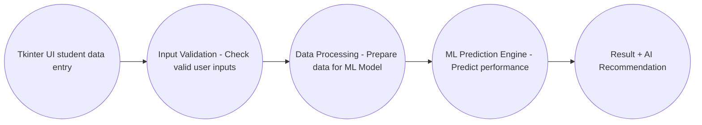
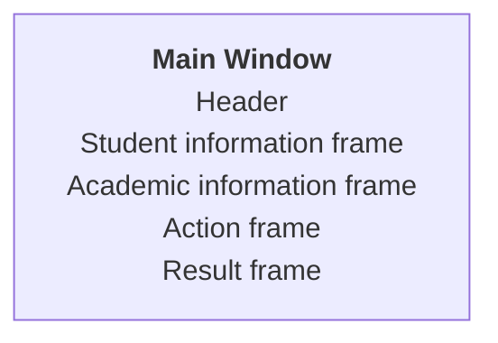

# Smart_Student_Performance_Prediction_System

#### 1. Problem Statement:
- Student performance is influenced by multiple academic and behavioral factors.
- Faculty may find it difficult to identify students who are at risk at an early stage.
- A data-driven system can help predict student performance.
- The system can provide recommendations for improving students outcomes.

#### 2. Proposed Solution:
- Collect Student-related information.
- Process the entered date.
- Use a Machine Learning model to predict performance.
- Classify students based on predicted performance.
- Generate intelligent recommendations.
- Display the results through a user-friendly Tkinter interface.

#### 3. Process Flow:
<p align="center"> Start <br> &darr; <br> Enter Student Details <br> &darr; <br> Validate Input <br> &darr; <br> Preprocess Data <br> &darr; <br> ML Prediction <br> &darr; <br> Determine Performance Level  <br> &darr; <br> Generate AI Recommendation <br> &darr; <br> Display Result <br> &darr; <br> End</p>

#### 4. Project Mapping:
| V-Model Stage           | Smart Student Project                       |
|:------------------------|:--------------------------------------------|
| Requirement Analysis    | Identify student performance problem        |
| System Design           | Design system architecture and UI           |
| Implementation          | Develop Python + ML application             |
| Integration             | Integrate UI, ML and AI                     | 
| Testing                 | Test individual modules and complete system |
| Validation              | Check system against requirements           |
| Demonstration           | Present working capstone                    |

### 5. Requirement Analysis
#### 5.1 Functional Requirements
The system should:
+ Accept students details.
+ Validate user inputs.
+ Store/process student information.
+ Preprocess input data.
+ Apply the trained ML model.
+ Predict student performance.
+ Generate recommendations.
+ Display results through the GUI.
+ Handle invalid inputs.
+ Provide a reset/clear options.

#### 5.2 Non Functional Requirements:
The applications should be:
+ User-friendly
+ Easy to understand
+ Fast in generating predictions
+ Reliable
+ Maintainable
+ Scalable
+ Secure with respect to student data
+ Easy to test

#### 5.3 Identify the Users
Primary Users may include:
  + Faculty
  + Academic coordinators
  + Mentors
  + Students

#### 5.4 User Requirements
The user should be able to:
+ Enter student information.
+ Submit the information for analysis.
+ View predicted performance.
+ Understand the student's risk level.
+ receive improvement recommendations.

#### 5.5 Identify System Inputs
The initial system can use:
+ Student ID
+ Student Name
+ Attendance Percentage
+ Study Hours per Day
+ Internal Assessment Marks
+ Assignment completion Percentage
+ Previous Academic Performance

#### 5.6 Identify System Outputs
###### 5.6.1 Performance Prediction
  + Excellent
  + Good
  + Average
  + At risk

###### 5.6.2 Additional Outputs
  + Predictions score/probability
  + Risk level
  + Key factors affecting performance
  + Recommended actions

###### Example
__Prediction:__ Good  Performance \
__Risk:__ Low \
__Recommendation:__ Maintain Current Pattern and attendance 

#### 6. Project Modular Application Development
Create separate functions:
```
get_student_data()
calculate_average()
calculate_performance()
display_result()
```
#### 7. From Requirements to System Design
##### __7.1 Input__
+ Student ID
+ Student Name
+ Attendance %
+ Study Hours
+ Internal Marks
+ Assignment Completion %
+ Previous Academic Performance

##### __7.2 Processing__
+ Validate input
+ Preprocess data
+ Send data to ML Model
+ Generate prediction
+ Generate recommendation

##### __7.3 Output__
+ Predicted performance
+ Performance category
+ Risk level
+ Recommendation

#### 8. Proposed System Architecture

#### 9. UI Design Requirements
The application must contain: 
> __1. Student Information Section__
   + Student ID
   + Student Name
  
> **2. Academic Information Section**
  + Attendance
  + Study Hours
  + Internal Marks
  + Assignment Completion
  + Previous Performance

> **3. Action Section**
  + Predict Performance
  + Clear
  + Exit

> **4. Result Section**
  + Predicted Performance
  + Risk Level
  + Recommendation

##### Using Frames


##### Workflow
<p align="center"><br> User Clicks Predict <br> &darr; <br> Button generates event <br> &darr; <br> Callback function executes <br> &darr; <br> Python processing starts <br></p>
